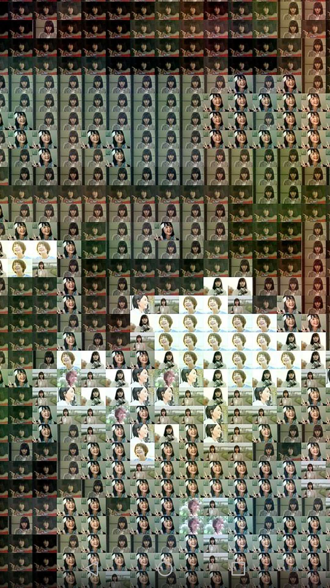

# 用一些小图 合成一个 大图。

小图构成大图的某个像素点

所谓的蒙太奇效果?

## 使用方法

1. 把小图放在./inputPics/中。
小图的数量可以很少(甚至一张)，但最后合成的大图中会出现多个重复的小图。
但建议多一点图，最好各种颜色的图都有。
(注意：小图都是需要横向的图，大图可以是纵向的也可以是横向的)

2. 把一张大图放在./mergePic/中。

3. 在main.m中设置，最小的像素数量minPicsNum(11行)。

运行main.m既可以在同文件夹下，得到outputImg.jpg

## demo

原图：

51984个像素小图的合成结果：

放大后的效果：

## 算法

1. 把输入的大图和小图裁剪成合适的大小。
2. 对于大图，根据 最小的像素数量minPicsNum，切割成很多个chunk
3. 对大图的每个chunk，计算它的RGB分别的平均值，找出最接近的那个小图，并进行一定的RGB修改。
4. 把所有匹配出来的小图合成最后的大图。
